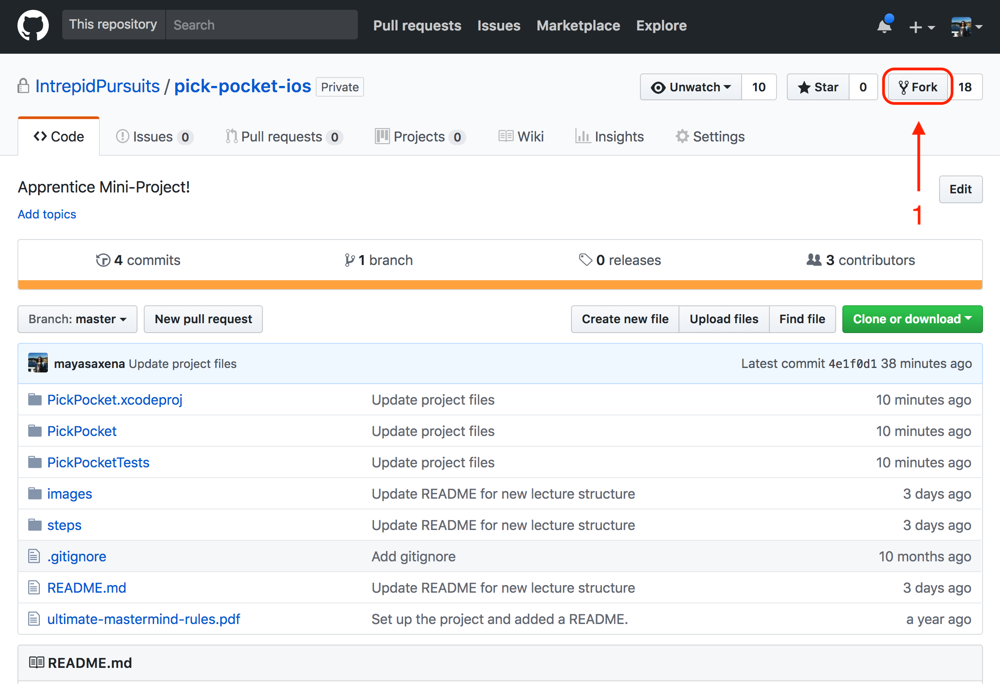
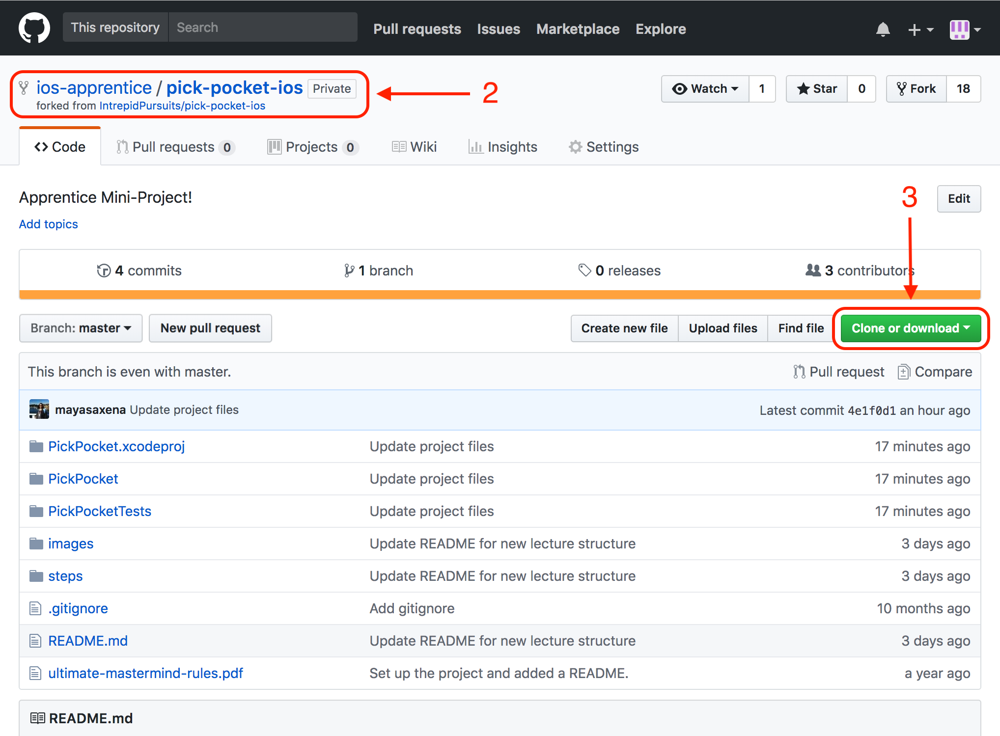
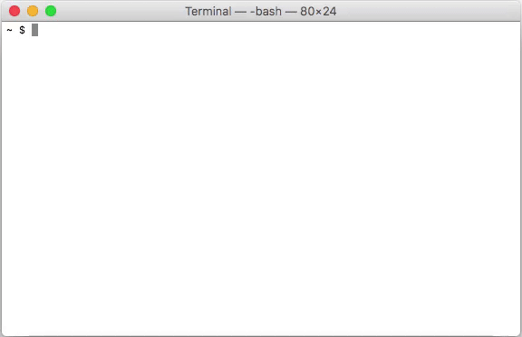

# Step 0: Hello, World

## Overview
In this step, you'll update the `README` of your personal fork of PickPocket. You should make your changes on a branch off the `master` branch of the repo and put up a PR with the changes. Once your mentor has reviewed the PR, you'll merge it to master through Github.

## Steps
1. Fork this repo and clone it to your computer.

    1. Click the "Fork" button in the top right corner of this screen. This will create a copy of the repo that belongs to you.

        

    1. After forking the repo, you'll be redirected to your version of the repo. Confirm that the header of the page looks like the one below, except with your Github username instead of `ios-apprentice`.

        

    1. Click the green button on the right side of the page that says "Clone or download". Copy the link that appears.

    1. Open up Terminal and navigate to the directory that you want to download the repo to. Run the following command:
        ```
        git clone <paste link you copied here>
        ```
        

        > Take a look [here](https://help.github.com/articles/fork-a-repo/) for some more info about forking and cloning
---
2. Open the project in Xcode, build, and run
    1. Open the project
        - Through the command line (Terminal):

            Run the following commands in the folder you cloned the project to:
            ```
            cd pick-pocket-ios
            open pick-pocket-ios.xcodeproj/
            ```
        ##### OR
        - Through Xcode:

            1. Open Xcode
            1. Click on "Open another project..." at the bottom of the window
            1. Navigate to your project in Finder
            1. Select `pick-pocket-ios.xcodeproj`
            1. Click "Open"

    1. To build and run, click the Play button in the top left corner of the Xcode window or press <code>cmd + r</code></li>

---

3. Update README
    1. Create a branch called `<your-name>/update-readme` e.g `apprentice/update-readme`
    1. Update the first line in the `README` to include your apprentice class and name. e.g "PickPocket - Spring 2018 - Apprentice McDeveloper"
    1. Add, commit and push your changes.
    1. With your mentor's assistance, put up a PR against your own repo (not the Intrepid repo) with your changes.
    1. Once the PR is reviewed and approved, merge your PR.
