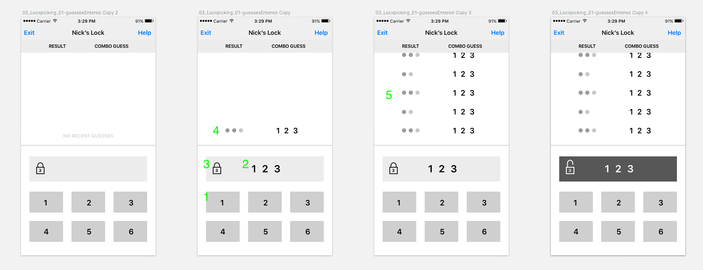

# Step 2: Create UI

## Overview
In this step, you'll build the UI for PickPocket using designs from Zeplin and the wireframes given below

## Steps
1. Create a user interface. You must include all the features in the design, but feel free to customize the colors, fonts and images.
    - Your UI should be based off the wireframes and the layout should match the designs in [Zeplin]()
    - You should use a `xib` file for this screen, **not** a storyboard or programmatic layout
    - The screen should include:
        - (1) Six buttons that will allow the user to input digits 1-6. We will keep the number of buttons static for now, but imagine that we could change the number of buttons in the future!
        - (2) A readout to display the guess as it is created
        - (3) A lock icon and an indicator of how long the lock code is
        - (4) A feedback indicator for the most recent guess

1. Use AutoLayout to make your design work on all different screen sizes.

**Important**: This step does not include any functionality of any screen elements, it only covers the creation of the UI. Your PR for this step should not include any interactions.
